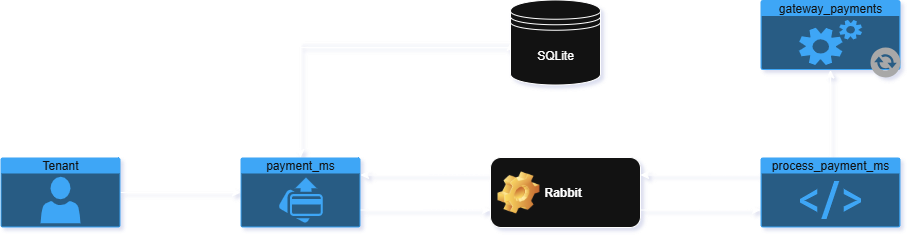

# Payments System


Este projeto é composto por três aplicações principais:


-  **payments-microservice** (Node.js / NestJS)

-  **payments-processor** (Go)

-  **payments-client** (Frontend)

---
## Fluxo principal:




Além disso, foi utilizado **PostgreSQL** e **RabbitMQ**, ambos executados via Docker.


---


## 🚀 Pré-requisitos


- Docker e Docker Compose

- Node.js (22.17.1+ recomendado)

- Go (v1.20+)

-  `make` instalado (Linux/macOS ou Windows via WSL, 4.3+)

-  `air` para hot reload no Go (opcional): https://github.com/cosmtrek/air


---


## 🐘 Subindo PostgreSQL e RabbitMQ


Execute o seguinte comando para iniciar os serviços:


```bash

docker-compose  -f  docker-compose-dev.yml  up  -d

```


---


## 📦 Microserviço Node.js (NestJS)


1. Acesse o diretório do microserviço:


```bash

cd  packages/payments-microservice

```


2. Instale as dependências:


```bash

npm  install

```


3. Gere os arquivos do Prisma:


```bash

npx  prisma  generate

```


4. Rode as migrações do banco:


```bash

npx  prisma  migrate  dev

```


5. Popule o banco com dados iniciais (seed):


```bash

npm  run  seed

```


6. Inicie o servidor em modo desenvolvimento:


```bash

npm  run  start:dev

```


---


## ⚙️ Aplicação Go (payments-processor)


1. Acesse o diretório da aplicação Go:


```bash

cd  packages/payments-processor

```


2. Instale as dependências (se necessário):


```bash

go  mod  tidy

```

3. Execute a aplicação com `make` ou `air`:


```bash

make  run

# ou

air

```
---

## 🧑‍💻 Frontend (payments-client)

1. Acesse o diretório do client:

```bash

cd  packages/payments-client

```

2. Instale as dependências:


```bash

npm  install

```

3. Rode o ambiente de desenvolvimento:


```bash

npm  run  dev

```

---


## 🌐 Endpoints

-  **Client**: [http://localhost:8080](http://localhost:8080)

-  **Swagger (API Docs)**: [http://localhost:3000/api-docs](http://localhost:3000/api-docs)

---

## ✅ Pronto! O sistema está rodando localmente.